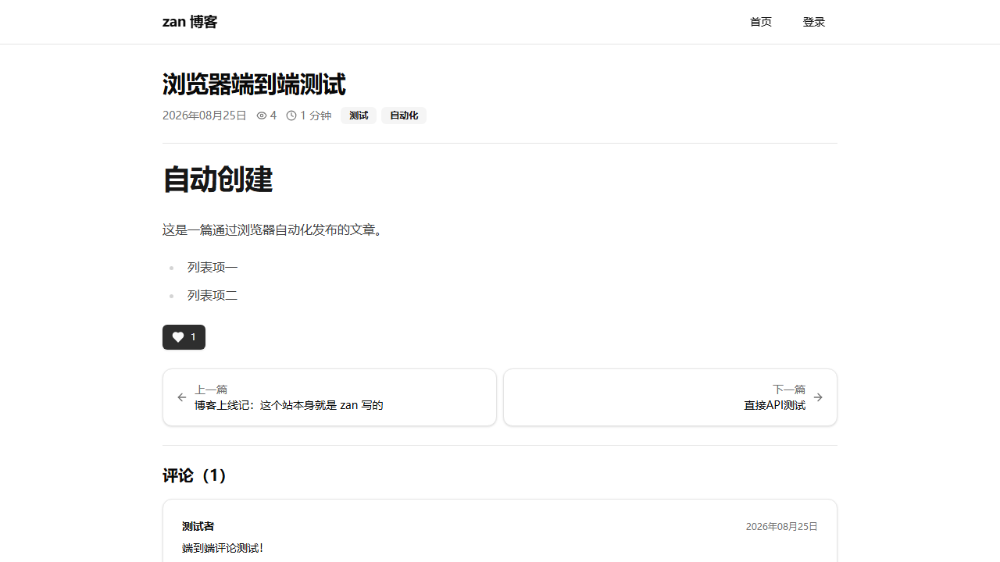

# zan-blog —— 用 zan 写的功能完备的博客

**一个 Python 进程搞定一切**：后端是 zan（本仓库的 Rust 内核 Web 框架），
前端是 React + shadcn/ui 的 Vite 构建产物，由同一个 zan 进程直接服务。
没有独立的前端服务，没有跨域，没有反向代理需求。



## 功能

- 文章：Markdown 渲染、草稿/发布、slug 自动生成、浏览量、阅读时长
- 列表：分页、关键词搜索（标题/摘要/正文）、标签筛选
- 标签：自动聚合、按热度排序
- 评论：发表与展示（无需登录）
- 点赞：每会话一次，幂等
- 管理端：密码登录（会话 Cookie）、新建/编辑/删除文章、草稿管理
- SPA：客户端路由，未知路径回退 index.html，`/api/*` 保持 JSON 404

## 运行

```bash
# 构建 Rust 扩展（仓库根目录，首次）
maturin develop --release

# 构建前端（首次或改动前端后）
cd blog/frontend && pnpm install && pnpm build   # 产物输出到 blog/backend/static/

# 启动（blog/backend 目录）
cd blog/backend
python app.py          # http://127.0.0.1:8000
```

环境变量：

| 变量 | 默认 | 说明 |
| --- | --- | --- |
| `BLOG_ADMIN_PASSWORD` | `admin123` | 管理密码 |
| `BLOG_PORT` | `8000` | 端口 |
| `BLOG_TITLE` | `zan 之声` | 站点名 |
| `BLOG_DB` | `blog/backend/blog.db` | SQLite 路径 |
| `BLOG_SECRET_KEY` | 随机 | 会话签名密钥（生产必设） |

首次启动自动写入 5 篇示例文章（仅当库为空）。

## 结构

```
blog/
  API.md               前后端 API 契约
  frontend/            React + TypeScript + shadcn/ui 源码（Vite）
    src/pages/         首页/详情/登录/管理/编辑器
    src/lib/api.ts     API 封装（统一错误处理）
  backend/
    app.py             zan 应用：API + SPA 服务
    db.py              SQLite 数据层
    seed.py            种子数据
    static/            前端构建产物（Vite 输出，勿手改）
```

## 验证过的链路

- API：列表/分页/搜索/标签、详情（Markdown/上下篇/浏览量）、登录/登出、
  草稿可见性（匿名不可见、管理员可见）、创建/更新/删除、评论、幂等点赞、
  未认证写入 401
- UI（真实浏览器）：首页渲染、文章详情、登录跳转、管理列表（草稿 Badge）、
  新建文章、评论提交、点赞即时更新
- 开发中还发现并修复了框架的一个真实缺陷：同一 URL 规则注册多个
  方法分立的视图时后者覆盖前者（`tests/test_same_rule_methods.py`）
